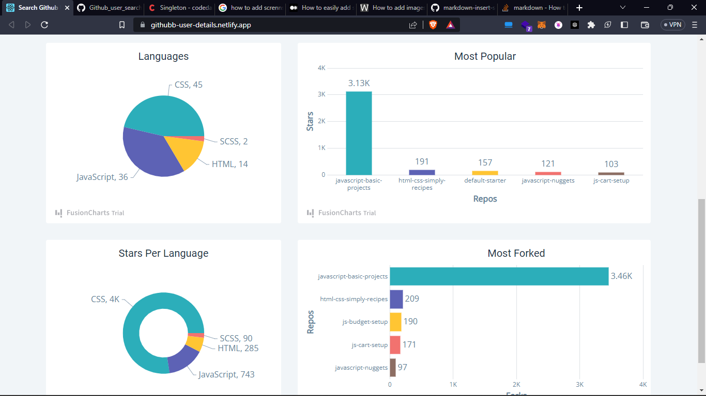

# GitHub User Details

This project is a web application that allows users to enter a GitHub username and fetch information about the user. It's built using React and demonstrates how to handle API calls, style components, and render various types of graphs such as column and doughnut.

## Features

- Search for GitHub users by their username
- Display user information including name, bio, followers, following, and more
- Render graphs showcasing user's repositories and languages used
- Responsive design for mobile and desktop devices

## Live Demo

The site is live at [https://githubb-user-details.netlify.app/](https://githubb-user-details.netlify.app/)

## Technologies Used

- React
- GitHub API
- CSS
- Chart.js (for rendering graphs)

## Getting Started

To get started with this project, follow these steps:

1. Clone the repository:

git clone https://github.com/yourusername/github-user-details.git

2. Change into the project directory:

cd github-user-details

3. Install the dependencies:

npm install

4. Start the development server:

npm start

5. Open your browser and visit `http://localhost:3000`.

## Contributing

If you'd like to contribute to this project, please feel free to submit a pull request or open an issue.

## License

This project is licensed under the MIT License.
